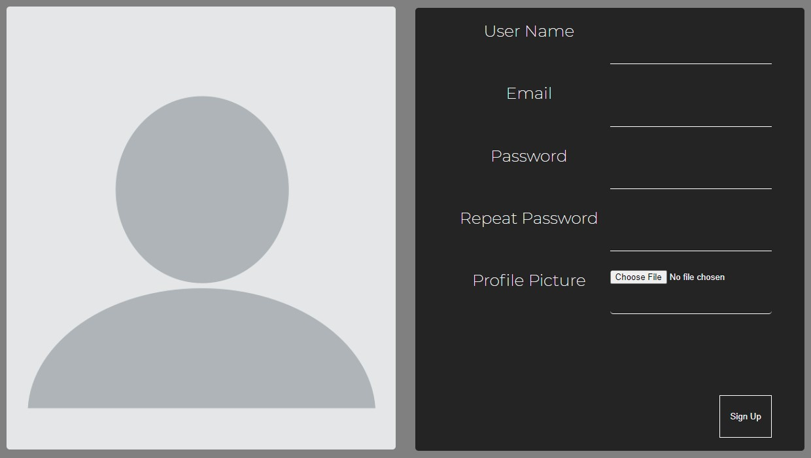
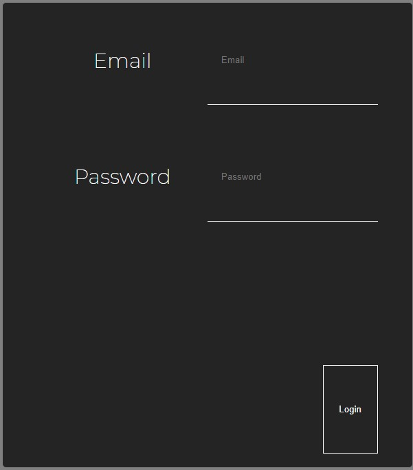
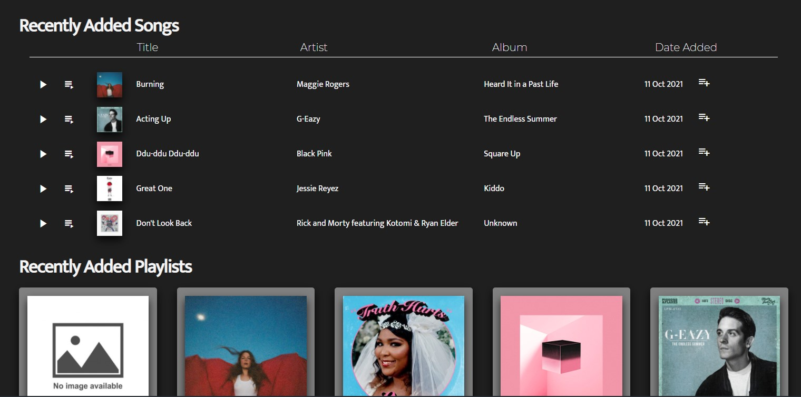
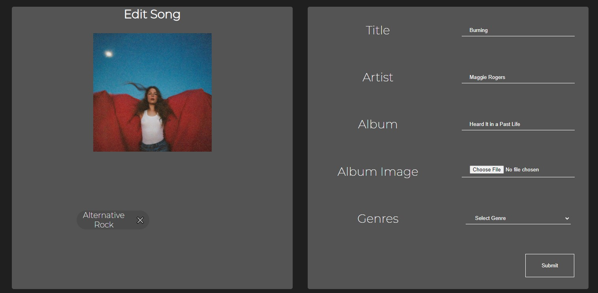
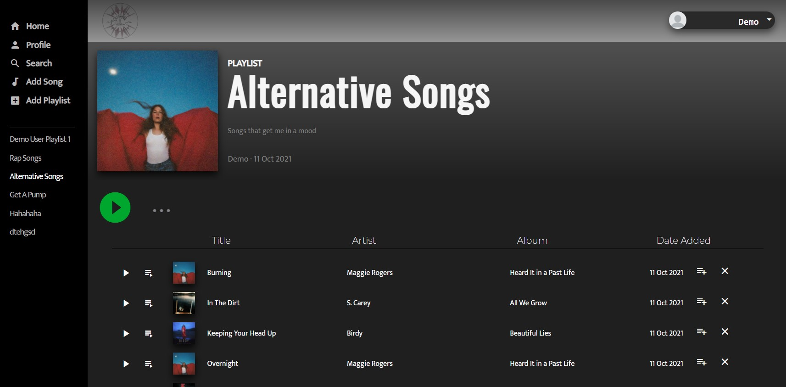
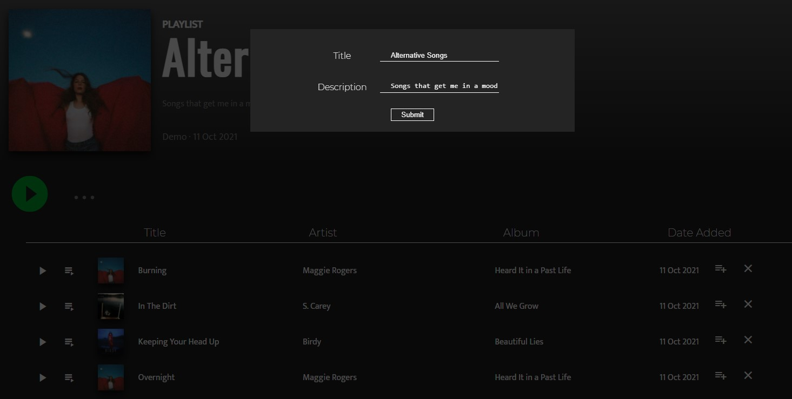

# Waveform

Waveform is a Spotify clone where users can come to listen, share, and socialize about music. It is a fullstack React App made with a Redux state manager and a backend using Python, Flask, SQL-Alchemy, PostgresSQL and other technologies.

-   View the <a href='https://waveform-app.herokuapp.com/'>Waveform</a> App Live

-   Reference to the Waveform <a href='https://www.github.com/jujmart/Waveform/wiki'>Wiki Docs</a>

| Table of Contents                                                        |
| ------------------------------------------------------------------------ |
| 1. [Features](#features)                                                 |
| 2. [Installation](#installation)                                         |
| 3. [Technical Implementation Details](#technical-implementation-details) |
| 4. [Future Features](#future-features)                                   |
| 5. [Contact](#contact)                                                   |

## Technologies

-   <a href="https://developer.mozilla.org/en-US/docs/Web/JavaScript"></a>
-   <a href="https://www.postgresql.org/"></a>
-   <a href="https://nodejs.org/"></a>
-   <a href="https://reactjs.org/"></a>
-   <a href="https://redux.js.org/"></a>
-   <a href="https://developer.mozilla.org/en-US/docs/Web/CSS"></a>
-   <a href="https://www.python.org/"></a>
-   <a href="https://flask.palletsprojects.com/"></a>
-   <a href="https://www.heroku.com/home"></a>
-   <a href="https://alembic.sqlalchemy.org/">Alembic</a>

## Features

### Log In and Sign Up




### Feed Page

Waveform feed displays most recent songs and playlists
Discover and search for new songs and playlists


### Add Songs

Add a new song to the database

Cancel adding song


### Edit Songs

Edit a song in the database

Cancel editing song


### View and Delete Songs

Delete a song from the database

Cancel deleting song


### View Playlist

Single playlist and the songs within it


### Add Playlists

Add a new playlist to the database

Cancel adding playlist


### Edit Playlists

Edit a playlist in the database

Cancel adding playlist


### Delete Playlists

Delete a playlist from the database

Cancel deleting playlist


-   Add any more features here

## Installation

To build/run project locally, please follow these steps:

1. Clone this repository

```shell
git clone https://github.com/jujmart/Waveform.git
```

2. Install Pipfile dependencies and create the virtual environment

```shell
pipenv install
```

2. Install npm dependencies for the `/react-app`

```shell
cd react-app
npm install
```

3. In the `/` root directory, create a `.env` based on the `.env.example` with proper settings

4. Setup your PostgreSQL user, password and database and ensure it matches your `.env` file

5. Before running any flask commands, confirm you are in the pipenv virtual env. If not, run the command:

```shell
pipenv shell
```

6. In the root folder, migrate tables to the database by running in the terminal:

```shell
flask db upgrade head
```

7. In the root folder, seed the database by running in the terminal:

```shell
flask seed all
```

8. Start the flask backend in the `/` root directory

```shell
flask run
```

9. Start the frontend in the `/react-app` directory

```shell
npm start
```

## Technical Implementation Details

### AWS S3 Image and Song Upload

One challenge that we faced was finding a way to have a user select an audio file on the frontend and for our app to pass it to the backend and store it. We started off attempting to pass the file directly from the input field as JSON to our Flask backend, but we soon realized that the information Flask received was not in an appropriate form to be handled and stored. After some research, we were able to find that the file could be stored into FormData in a manner that would allow us to pass it to the backend in a Flask readable form. From there, we were able to utilize Boto3 to programatically store the songs and album images into AWS S3.

In our React frontend song creation form, we create a new FormData instance and set the song and album image files to properties on it.

```javascript
let songData = new FormData();
songData.set("file", songUrl);
songData.set("image", albumImage);

const data = {
	title,
	artist: artist || null,
	album: album || null,
	genres,
};
```

Here, we send our FormData and other song data to our Redux thunk.

```javascript
const response = await dispatch(uploadSongThunk(data, songData));
```

Our thunk will make a post request to our Flask backend, sending the song data as a file rather than JSON.

```javascript
export const uploadSongThunk = (payload, songData) => async (dispatch) => {
	// Additional code excluded for brevity
			const AWSResponse = await fetch(
				`/api/songs/AWS/${SQLData.songId}`,
				{
					method: "POST",
					body: songData,
				}
			);

			if (AWSResponse.ok) {
				const AWSData = await AWSResponse.json();
				if (AWSData.errors) {
					return AWSData;
				}
			}
			return SQLData;
		}
	}
};
```

Once our data reaches the Flask backend, we verify the file, we verify its type, we upload it to AWS and we receive a url to the AWS stored file to put in our database.

```python
@songs_routes.route("/AWS/<int:id>", methods=['POST'])
@login_required
def post_song_url(id):
    # for song upload
    if "file" not in request.files:
        return {"errors": "song required"}#, 400

    song = request.files['file']

    if not allowed_file(song.filename):
        return {"errors": "file type not permitted"}#, 400

    song.filename = get_unique_filename(song.filename)

    songUpload = upload_file_to_s3(song)

    if "url" not in songUpload:
        return songUpload#, 400

    songUrl = songUpload["url"]

    song_to_update = Song.query.get_or_404(id)
    song_to_update.songUrl = songUrl
    db.session.commit()
```

The process above is repeated for the album image as well, but we only show the song upload snippet for brevity.

## Future Features

1. **Waveform** - background waveform that moves along with the song being played

2. **Liked Songs Playlist** - playlist composed of songs liked by the user

3. **Music Shuffle** - ability to shuffle songs randomly

4. **Order Playlist Songs** - ability to order songs within playlist

## Contact

### Justice Martin

<a href="https://www.linkedin.com/in/justice-martin-34043340/"></a><a href="https://github.com/jujmart"></a>

<!-- <a href="https://angel.co/u/{angel-list-handle}"></a> -->

jujmart12@gmail.com

### Maxwell Wehner

<a href="https://www.linkedin.com/in/maxwell-wehner-7a2066220/"></a><a href="https://github.com/MaxwellWehner"></a>

<!-- <a href="https://angel.co/u/{angel-list-handle}"></a> -->

maxwehnerwork@gmail.com

### Andrew Watkins

<a href="https://www.linkedin.com/in/andrew-watkins-533280173/"></a><a href="https://github.com/andru17urdna"></a>

<!-- <a href="https://angel.co/u/{angel-list-handle}"></a> -->

dr3wwatkins@gmail.com
